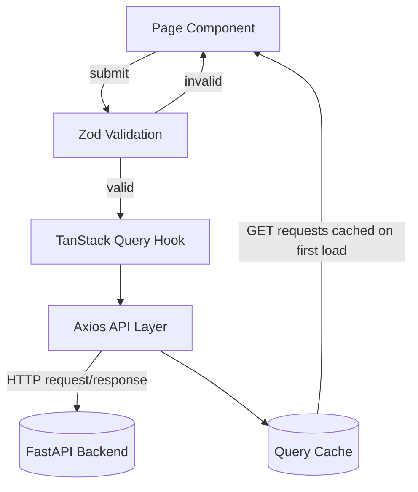

# Skylink — Flight Booking & Reservation Management API

🔗 **[Live Demo](skylink-frontend-two.vercel.app)** · 🎬 **[Demo Video](https://drive.google.com/file/d/1qPAw76EiD4wf2H8K3PXTD4AjTSnyFDEk/view?usp=sharing)** · 💻 **[Backend Repo](https://github.com/edrian-a-marinas/skylink-api)**

## What It Does

Booking a flight is only half the job — the other half is managing it afterward: checking a reservation status, rescheduling around a changed plan, or getting a refund without digging through emails. Skylink's frontend gives passengers a single, role-aware interface for the full journey — search flights, book seats, pay securely, and manage bookings after the fact — while admins get their own dashboard to manage flights, users, bookings, and promotions, all backed by a type-safe API layer.

---

## Key Features 

- **Role-based routing** — separate routes and layouts for guests, passengers, and admins, enforced with route guards (`ProtectedRoute`, `PublicOnlyRoute`, `AdminRoute`).
- **Full booking flow** — search flights, pick seats, enter passenger details, and pay, guided step by step from search to confirmation.
- **Manage bookings** — view booking history, reschedule, or cancel a trip, with live status updates.
- **Form validation** — Zod schemas validate every form (passenger details, rescheduling, cancellation reasons) before anything is sent to the API.
- **Session handling** — signed-in state persists across page reloads, with automatic logout when a session token expires.
- **Smart data fetching** — booking and flight data is cached and automatically refreshed after actions like cancel or reschedule, so screens stay in sync without manual refetching.
- **Admin dashboard** — manage flights, users, bookings, promotions, and destinations, plus generate and export reports.
- **ML-powered insights** — admin dashboard surfaces revenue forecasts, route demand predictions, cancellation risk scores, and dynamic pricing suggestions, backed by real booking data.
- **Responsive, accessible UI** — built with Tailwind CSS for a consistent experience across devices.

---

## Architecture Overview



---

## Tech Stack

| Layer | Technology |
|-------|------------|
| Backend | Python, FastAPI, PostgreSQL, SQLAlchemy, Alembic, Pytest, asyncio, SlowAPI |
| Frontend | React, TypeScript, TanStack, Zod, Zustand, Axios, React Hook Form, TailwindCSS |
| AI / ML | scikit-learn (Linear/Logistic Regression), NumPy — forecasting, prediction, dynamic pricing suggestions (seeded datas) |
| Auth | JWT, Google OAuth, bcrypt password hashing, OTP email verification |
| Security | Role-based dependencies, Rate limiting, CORS, Trusted Host, ORM-protected SQL, PayMongo webhook signature verification |
| Performance | Redis (cache + rate limiting), end-to-end pagination, Tanstack Query, database indexes |
| Deployment | Render, Vercel, Supabase |

---

## Structure & Data Flow

- **Architecture**: Layered structure — `pages → hooks → api → validation/types`
- **Routing**: React Router with route-level guards (`ProtectedRoute`, `PublicOnlyRoute`, `AdminRoute`) and centralized route constants
- **Validation**: Zod schemas validate all form inputs client-side before any request is sent
- **Data fetching**: TanStack Query per-domain hooks (e.g. `useMyBookings`, `useBookingDetail`) manage caching, loading, and error state
- **API layer**: Centralized Axios instance with request/response interceptors (auth token injection, auto-logout on expired/401 session)
- **State management**: React Context for global auth state, with session persisted in local storage and restored on reload
- **Type safety**: Shared TypeScript types per domain, inferred from Zod schemas where possible
- **Code quality**: Enforced via ESLint

---

## Local Setup

### Prerequisites
- Python 3.12+
- Node.js for the frontend

### Backend
1. Clone the repo and navigate into it
```bash
git clone https://github.com/edrian-a-marinas/skylink-api.git
cd skylink-api
```
2. Create a virtual environment and install dependencies
```bash
python3 -m venv venv && source venv/bin/activate   # venv\Scripts\activate on Windows
pip install -r requirements.txt
```
3. Copy the environment template and fill in your values
```bash
cp .env.example .env
```
4. Run database migrations

> **Note:** This project's migrations include Supabase-specific RLS policies (using `auth.role()`), which require a Supabase-backed database. If `DATABASE_URL` points to plain local PostgreSQL (not Supabase), this step will fail with `schema "auth" does not exist`. The API itself (step 5) runs fine regardless — this only affects the RLS-related migrations.

```bash
alembic upgrade head
```
5. Start the API server
```bash
uvicorn app.main:app --reload
```
API available at `http://localhost:8000/docs`

### Frontend
1. Clone the repo and navigate into it
```bash
git clone https://github.com/edrian-a-marinas/skylink-client.git
cd skylink-client
```
2. Install dependencies
```bash
npm install
```
3. Copy the environment template and fill in your values
```bash
cp .env.example .env.local
```
4. Start the dev server
```bash
npm run dev
```
5. App available at `http://localhost:5173`

---
## Congrats, App Running! 🎉

